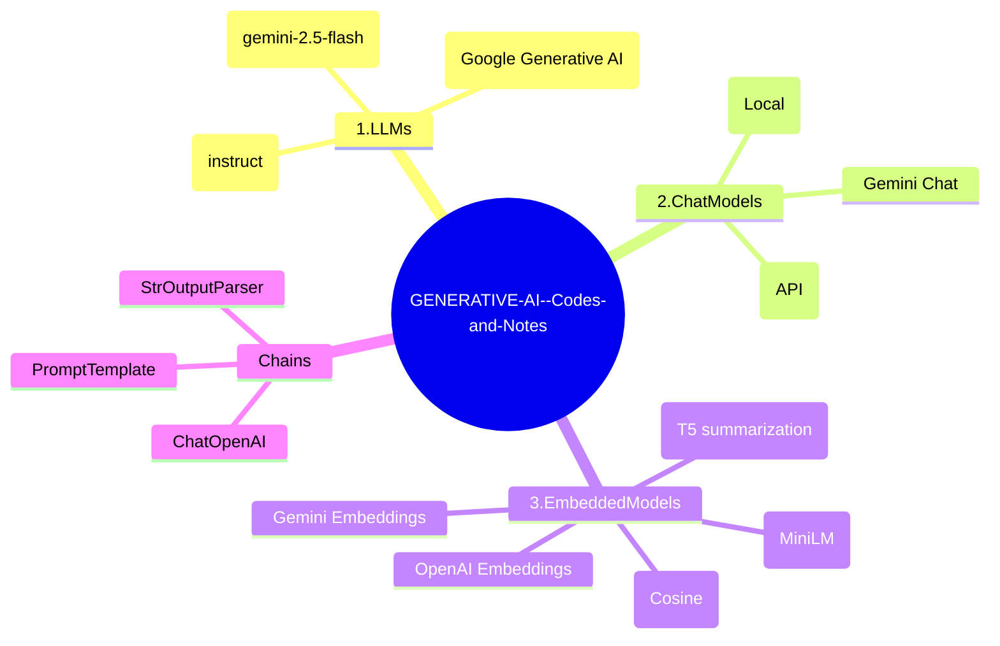

<div align="center">

# 🧠 GENERATIVE AI — Codes & Notes
### LangChain + OpenAI + Gemini + Hugging Face (Chat, LLMs, Embeddings & Chains)

<p align="center">
  <a href="https://github.com/gaurav-singh-tech/GENERATIVE-AI--Codes-and-Notes"></a>
  <a href="https://github.com/gaurav-singh-tech?tab=repositories"></a>
  <a href="https://www.linkedin.com/in/contact-gauravsingh/"></a>
  <a href="https://www.gaurav-singh-portfolio.me/"></a>
</p>

**A premium, practical repository of Generative AI experiments** — built around **LangChain** integrations for:
**LLMs**, **Chat Models**, **Embeddings / Similarity**, and **Chains**.

</div>

---

## ✨ What’s Inside (based on this repo’s actual files)

This repository is organized into focused folders:

| Module | Folder | What you’ll learn & run |
|---|---|---|
| **LLMs (Completion)** | `1.LLMs/` | OpenAI LLM (instruct) + Gemini LLM + model discovery |
| **Chat Models** | `2.ChatModels/` | Gemini chat, Hugging Face chat (local + API) |
| **Embeddings** | `3.EmbeddedModels/` | OpenAI / Gemini / HF embeddings, document similarity (cosine) |
| **Chains** | `Chains/` | A simple LangChain pipeline (`Prompt → Model → Output Parser`) |

---

## 🧭 Visual Mindmap (Repository Map)



---

## 📊 Infographic (What This Repo Covers)

```text
┌────────────────────────────────────────────────────────────┐
│                 GENERATIVE AI PLAYGROUND                   │
├────────────────────────────────────────────────────────────┤
│  ✅ LLMs (Completion)                                      │
│     - OpenAI instruct LLM via langchain_openai             │
│     - Gemini LLM via langchain_google_genai                │
│                                                            │
│  ✅ Chat Models                                             │
│     - Gemini Chat                                           │
│     - HuggingFace Chat (Local pipeline)                     │
│     - HuggingFace Chat (Hosted Inference API)               │
│                                                            │
│  ✅ Embeddings & Similarity                                 │
│     - OpenAI / Gemini / HuggingFace embeddings              │
│     - Cosine similarity ranking                             │
│                                                            │
│  ✅ Chains                                                  │
│     - Prompt → Model → Output parser pipeline               │
└────────────────────────────────────────────────────────────┘
```

---

## 🚀 Quick Start

### 1) Install dependencies
```bash
pip install -r requirements.txt
```

### 2) Create `.env` (recommended)
This repo loads environment variables using `python-dotenv` in multiple scripts.

Create a `.env` file and add what you need:

```bash
OPENAI_API_KEY=your_openai_key
GOOGLE_API_KEY=your_gemini_key
HUGGINGFACEHUB_ACCESS_TOKEN=your_hf_token
```

> Note: Some scripts include comments that keys may be expired / quota exhausted — that’s expected if you don’t have active credentials.

---

## 🧩 “Run by Topic” (Clickable Buttons)

<div align="center">

<a href="#-llms-folder-1llms"></a>
<a href="#-chat-models-folder-2chatmodels"></a>
<a href="#-embeddings--similarity-folder-3embeddedmodels"></a>
<a href="#-chains-folder-chains"></a>

</div>

---

## 🧠 LLMs (folder: `1.LLMs/`)

### ✅ OpenAI LLM (instruct)
- File: `1.LLMs/llm_openai.py`
- Uses: `langchain_openai.OpenAI` with `gpt-3.5-turbo-instruct`

Run:
```bash
python 1.LLMs/llm_openai.py
```

### ✅ Gemini LLM
- File: `1.LLMs/llm_gemini.py`
- Uses: `GoogleGenerativeAI(model="gemini-2.5-flash", version="v1beta")`

Run:
```bash
python 1.LLMs/llm_gemini.py
```

### ✅ Check available Gemini models for your key
- File: `1.LLMs/check_models.py`
Run:
```bash
python 1.LLMs/check_models.py
```

---

## 💬 Chat Models (folder: `2.ChatModels/`)

### ✅ Gemini Chat
- File: `2.ChatModels/chatmodel_gemini.py`

Run:
```bash
python 2.ChatModels/chatmodel_gemini.py
```

### ✅ Hugging Face Chat — Local (downloads model locally)
- File: `2.ChatModels/chatmodel_hf_local.py`
- Model: `TinyLlama/TinyLlama-1.1B-Chat-v1.0`

Run:
```bash
python 2.ChatModels/chatmodel_hf_local.py
```

### ✅ Hugging Face Chat — API (Hosted Inference)
- File: `2.ChatModels/chatmodel_huggingface_api.py`

Run:
```bash
python 2.ChatModels/chatmodel_huggingface_api.py
```

---

## 🧷 Embeddings & Similarity (folder: `3.EmbeddedModels/`)

### ✅ Document Similarity (Cosine similarity ranking)
- File: `3.EmbeddedModels/document_similarity.py`
- Embeddings: `sentence-transformers/all-MiniLM-L6-v2`
- Similarity: `sklearn.metrics.pairwise.cosine_similarity`

Run:
```bash
python 3.EmbeddedModels/document_similarity.py
```

### ✅ OpenAI Embeddings (query)
- File: `3.EmbeddedModels/embedding_openai_query.py`

Run:
```bash
python 3.EmbeddedModels/embedding_openai_query.py
```

### ✅ OpenAI Embeddings (documents)
- File: `3.EmbeddedModels/embedding_openai_query_docs.py`

Run:
```bash
python 3.EmbeddedModels/embedding_openai_query_docs.py
```

### ✅ Gemini Embeddings
- File: `3.EmbeddedModels/embedding_gemini_query.py`

Run:
```bash
python 3.EmbeddedModels/embedding_gemini_query.py
```

### ✅ Hugging Face Embeddings (local)
- File: `3.EmbeddedModels/embedding_hf_local.py`

Run:
```bash
python 3.EmbeddedModels/embedding_hf_local.py
```

### 🧪 Streamlit Research Tool (T5 summarization UI)
- File: `3.EmbeddedModels/prompts.py`
- UI: Streamlit
- Model: `t5-small` summarization pipeline

Run:
```bash
streamlit run 3.EmbeddedModels/prompts.py
```

---

## ⛓ Chains (folder: `Chains/`)

### ✅ Simple LangChain Pipeline
- File: `Chains/simple_Chain.py`
- Pattern: `PromptTemplate → ChatOpenAI → StrOutputParser`

Run:
```bash
python Chains/simple_Chain.py
```

---

## 🃏 Flashcards (Actual, Relevant to This Repo)

> Use these as quick recall cards while exploring the code.

### Flashcard 1 — LLM vs Chat Model
**Q:** When should I use `OpenAI()` vs `ChatOpenAI()` in LangChain?  
**A:** `OpenAI()` is classic completion-style LLM usage (instruct). `ChatOpenAI()` is message-based chat completion.

### Flashcard 2 — Temperature
**Q:** What does `temperature` do?  
**A:** Controls randomness/creativity. Lower = more deterministic. Higher = more diverse output.

### Flashcard 3 — Embeddings
**Q:** Why generate embeddings?  
**A:** To convert text into vectors so you can compare meaning using similarity metrics (e.g., cosine similarity).

### Flashcard 4 — Cosine Similarity
**Q:** What does cosine similarity return?  
**A:** A score (often between -1 and 1) measuring how similar two vectors are by angle (semantic closeness).

### Flashcard 5 — HF Local vs HF API
**Q:** Difference between Hugging Face local pipeline and endpoint API?  
**A:** Local runs on your machine (downloads model). Endpoint uses hosted inference with your HF token.

### Flashcard 6 — Chains
**Q:** What’s a “chain” in LangChain?  
**A:** A composed pipeline: prompt formatting → model call → output parsing.

---

## 📦 Requirements (from `requirements.txt`)

This repo uses:

- `langchain`, `langchain-core`
- `langchain-openai`, `openai`
- `langchain-anthropic`
- `langchain-google-genai`, `google-generativeai`
- `langchain-huggingface`, `transformers`, `huggingface-hub`
- `python-dotenv`
- `numpy`, `scikit-learn`, `pandas`

---

## 🧑‍💻 Author

**Gaurav Singh**

- LinkedIn: https://www.linkedin.com/in/contact-gauravsingh/  
- GitHub: https://github.com/gaurav-singh-tech  
- Portfolio: https://www.gaurav-singh-portfolio.me/  

---

## 📌 Notes

- Some scripts mention expired keys / quota issues in comments — update your `.env` with active keys to run them successfully.
- The repo is intentionally practical: each file is a runnable “mini-demo” focusing on one concept.

---

<div align="center">

### ⭐ If you find this repo useful, consider starring it.
It helps others discover practical Generative AI experiments with LangChain.

</div>
