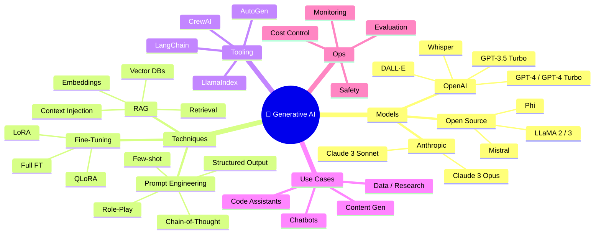

<div align="center">

# 🧠 Generative AI — Codes & Notes Repository  
### *Your End‑to‑End Playbook for Building, Understanding & Shipping Generative AI Systems*


> **A premium, curated collection of Generative AI code, notes, diagrams, workflows and real‑world patterns – from “What is an LLM?” to production‑grade RAG and multi‑agent systems.**

[🚀 Quick Start](#-quick-start) • [📚 Learning Paths](#-learning-paths) • [💡 Code Gallery](#-code-gallery) • [🧠 Mindmaps](#-mindmaps) • [📊 Feature Matrix](#-feature-matrix) • [📚 Resources](#-resource-library)

</div>

---

## ✨ What This Repository Gives You

This isn’t just another “hello world” repo.

It’s designed as a **living Generative AI handbook** for:

- 👩‍💻 **Developers** building LLM‑powered apps  
- 🧪 **Researchers & tinkerers** experimenting with prompts, RAG & fine‑tuning  
- 🧱 **Builders** deploying real systems with real constraints (latency, cost, safety)  

Inside you’ll find:

- ✅ **50+ code examples** (Python, API usage, RAG, fine‑tuning, agents)
- ✅ **Structured notes & diagrams** for fast recall
- ✅ **Mindmaps & ASCII infographics** to see the whole ecosystem at a glance
- ✅ **Flashcards** to drill core concepts
- ✅ **Learning paths** from beginner → intermediate → advanced
- ✅ **Production patterns** (FastAPI, Docker, basic K8s, cost‑optimization ideas)

---

## 🧠 Mindmaps

### 1. Generative AI Ecosystem (High‑Level)



---

## 📊 Visual Stack Infographic

```text
┌────────────────────────────────────────────────────────────┐
│                    GENERATIVE AI STACK                     │
├───────────────────────────────────────���────────────────────┤
│  🔹 INTERFACE                                              │
│     - Web UI · CLI · Notebooks · APIs                      │
├────────────────────────────────────────────────────────────┤
│  🔹 APPLICATION LAYER                                      │
│     - Chatbots · Agents · Content Pipelines · Tools        │
├────────────────────────────────────────────────────────────┤
│  🔹 ORCHESTRATION                                          │
│     - LangChain · LlamaIndex · AutoGen · CrewAI            │
├────────────────────────────────────────────────────────────┤
│  🔹 INTELLIGENCE                                           │
│     - GPT‑4 / Claude 3 / LLaMA / Mistral                   │
│     - Prompting · RAG · Fine‑tuning · Multi‑agent          │
├────────────────────────────────────────────────────────────┤
│  🔹 DATA + MEMORY                                          │
│     - Vector DBs (Pinecone, Weaviate, FAISS, Qdrant)       │
│     - Object Storage · Relational DBs                      │
├────────────────────────────────────────────────────────────┤
│  🔹 INFRASTRUCTURE                                         │
│     - Docker · K8s · Serverless · Observability · Auth     │
└────────────────────────────────────────────────────────────┘
```

---

## 🗂 Repository Structure (Conceptual)

```text
generative-ai-codes-notes/
│
├── 01_Foundations/          # LLM basics, transformers, embeddings
├── 02_Prompt_Engineering/   # Prompt patterns & anti-patterns
├── 03_API_Integrations/     # OpenAI, Anthropic, HF, local LLaMA
├── 04_RAG_Systems/          # Retrieval-Augmented Generation
├── 05_Fine_Tuning/          # LoRA, QLoRA, custom data
├── 06_Multi_Agent/          # Agent frameworks & workflows
├── 07_Production/           # FastAPI, Docker, minimal K8s
├── 08_Advanced/             # Quantization, distillation, caching
├── 09_Projects/             # Mini end‑to‑end apps
└── docs/                    # Notes, diagrams, cheat‑sheets
```

Use this as a reference when you map your actual folders.

---

## 🚀 Quick Start

### 1. Clone & Install

```bash
git clone https://github.com/<your-username>/generative-ai-codes-notes.git
cd generative-ai-codes-notes

python -m venv venv
source venv/bin/activate  # Windows: venv\Scripts\activate

pip install -r requirements.txt
```

### 2. Environment Setup

```bash
cp .env.example .env
# Fill in:
# OPENAI_API_KEY=sk-...
# ANTHROPIC_API_KEY=sk-ant-...
# HUGGINGFACE_API_KEY=hf_...
```

### 3. Smoke Test – Your First LLM Call

```python
from openai import OpenAI
import os

client = OpenAI(api_key=os.getenv("OPENAI_API_KEY"))

resp = client.chat.completions.create(
    model="gpt-4-turbo",
    messages=[
        {"role": "system", "content": "You are a concise tutor."},
        {"role": "user", "content": "Explain transformers in 3 bullet points."}
    ],
    max_tokens=200,
)
print(resp.choices[0].message.content)
```

---

## 📚 Learning Paths

### 🟢 Beginner (2–3 weeks): “I want to understand & play”

```text
1️⃣ Foundations
   ▸ What are LLMs? Tokens? Embeddings?
   ▸ Read notes on transformers, attention

2️⃣ First API Calls
   ▸ Call OpenAI / Claude from Python
   ▸ Build a tiny “Ask anything” CLI

3️⃣ Prompt Basics
   ▸ Try: instruction, few‑shot, role prompts
   ▸ Log what works vs what fails

4️⃣ Mini Project
   ▸ Simple FAQ chatbot over a text file
```

### 🟡 Intermediate (4–6 weeks): “I want to build real stuff”

```text
1️⃣ Advanced Prompting
   ▸ Chain-of-thought, self‑critique, structured JSON output

2️⃣ RAG Fundamentals
   ▸ Chunking, embeddings, vector search
   ▸ Build a Q&A bot over your PDFs

3️⃣ Multi‑Model Thinking
   ▸ Compare GPT‑4 vs Claude vs local LLaMA
   ▸ Choose models based on latency & cost

4️⃣ Project
   ▸ Your own “internal docs assistant”
```

### 🔴 Advanced (8–12 weeks): “I want to ship production systems”

```text
1️⃣ Fine‑Tuning
   ▸ LoRA/QLoRA on domain data
   ▸ Evaluation & safety checks

2️⃣ Multi‑Agent & Tools
   ▸ Agents that call tools / APIs
   ▸ Coordinating planner/worker agents

3️⃣ Production Architecture
   ▸ FastAPI backend + LLM service layer
   ▸ Caching, retries, logging, tracing

4️⃣ Capstone
   ▸ A complete app (e.g. research assistant,
      code review agent, or analytics copilot)
```

---

## 💡 Code Gallery

### 1️⃣ Simple Chat Completion

```python
from openai import OpenAI
import os

client = OpenAI(api_key=os.getenv("OPENAI_API_KEY"))

def ask_llm(prompt: str) -> str:
    response = client.chat.completions.create(
        model="gpt-4-turbo",
        messages=[{"role": "user", "content": prompt}],
        temperature=0.7,
        max_tokens=400,
    )
    return response.choices[0].message.content

print(ask_llm("Explain embeddings like I'm 12."))
```

---

### 2️⃣ Chain‑of‑Thought Prompt Template

```python
REASONING_PROMPT = """
You are a careful reasoning assistant.
Think step by step, and show your intermediate steps before the final answer.

Question: {question}

Let's reason it out step by step, then give the final answer clearly.
"""

print(ask_llm(REASONING_PROMPT.format(
    question="A train leaves at 10am at 60km/h and another at 11am at 80km/h from the same city. When do they meet if the distance is 420km?"
)))
```

---

### 3️⃣ Minimal RAG Pipeline (Conceptual)

```python
from langchain.embeddings import OpenAIEmbeddings
from langchain.vectorstores import FAISS
from langchain.text_splitter import RecursiveCharacterTextSplitter
from langchain.chains import RetrievalQA
from langchain.llms import OpenAI

# 1. Split docs
splitter = RecursiveCharacterTextSplitter(
    chunk_size=1000,
    chunk_overlap=200
)
chunks = splitter.split_text(open("docs/notes.txt").read())

# 2. Build vector store
emb = OpenAIEmbeddings()
vectordb = FAISS.from_texts(chunks, emb)

# 3. Build QA chain
qa = RetrievalQA.from_chain_type(
    llm=OpenAI(temperature=0.1),
    retriever=vectordb.as_retriever(search_kwargs={"k": 4}),
    return_source_documents=True,
)

result = qa("Summarize the key ideas in one paragraph.")
print(result["result"])
```

---

### 4️⃣ LoRA Fine‑Tuning Skeleton (High‑Level)

```python
from peft import LoraConfig, get_peft_model
from transformers import AutoModelForCausalLM, AutoTokenizer

BASE_MODEL = "meta-llama/Llama-2-7b-hf"

tokenizer = AutoTokenizer.from_pretrained(BASE_MODEL)
model = AutoModelForCausalLM.from_pretrained(BASE_MODEL)

lora_cfg = LoraConfig(
    r=16,
    lora_alpha=32,
    lora_dropout=0.05,
    bias="none",
    task_type="CAUSAL_LM",
)

model = get_peft_model(model, lora_cfg)
model.print_trainable_parameters()  # sanity check
# Then feed your train dataset into a Trainer / custom loop
```

---

### 5️⃣ Simple Multi‑Agent Sketch (AutoGen‑style)

```python
from autogen import AssistantAgent, UserProxyAgent

assistant = AssistantAgent(
    name="DevAssistant",
    system_message="You are a senior Python engineer.",
    llm_config={"model": "gpt-4-turbo"}
)

user = UserProxyAgent(
    name="User",
    human_input_mode="TERMINATE",
    max_consecutive_auto_reply=6,
)

user.initiate_chat(
    assistant,
    message="Design a REST API for an AI-powered todo app with endpoints.",
)
```

---

## 🔢 Flashcards (for Fast Recall)

> Use these as mental flashcards while learning.

**Flashcard 1 — Token**  
**Q:** What is a token in LLMs?  
**A:** The smallest unit of text the model sees (≈ 4 chars in English). Models have max tokens per request (context window).

---

**Flashcard 2 — Temperature**  
**Q:** What does temperature control?  
**A:** Randomness.  
Low (0–0.3) → deterministic, stable.  
High (0.7–1.0) → creative, varied.

---

**Flashcard 3 — Embeddings**  
**Q:** Why do we use embeddings?  
**A:** To convert text into vectors so we can search, cluster, and retrieve semantically similar items.

---

**Flashcard 4 — RAG**  
**Q:** What is Retrieval‑Augmented Generation?  
**A:** A pattern where we first retrieve relevant docs from a vector DB, then feed them into the LLM as context.

---

**Flashcard 5 — LoRA**  
**Q:** Main benefit of LoRA fine‑tuning?  
**A:** Only a small fraction of weights are trained → drastically lower compute & memory vs full fine‑tuning.

---

**Flashcard 6 — Few‑Shot**  
**Q:** What is few‑shot prompting?  
**A:** Giving 2–5 examples in the prompt so the model learns the pattern without gradient updates.

---

**Flashcard 7 — Context Window**  
**Q:** Why does it matter?  
**A:** It’s the max tokens (prompt + response). If you exceed it, your prompt gets truncated or rejected.

---

**Flashcard 8 — Function Calling / Tools**  
**Q:** Why use function calling?  
**A:** To let the model decide *when* and *how* to call your tools/APIs and return structured arguments.

---

## 📊 Feature Matrix

| Area | Included | What You’ll Find |
|------|----------|------------------|
| **Foundations** | ✅ | LLM basics, transformer notes, embeddings examples |
| **Prompting** | ✅ | Patterns (few‑shot, CoT, role), JSON output, templates |
| **APIs** | ✅ | OpenAI, Anthropic, HF, quick snippets |
| **RAG** | ✅ | LangChain+FAISS, chunking strategy, Q&A demos |
| **Fine‑Tuning** | ✅ | LoRA skeletons, config notes, evaluation tips |
| **Agents** | ✅ | AutoGen‑style examples, basic agent collaboration |
| **Production** | ✅ | FastAPI skeleton, Dockerfile, basic K8s manifest |
| **Optimization** | ✅ | Notes on quantization, caching, model choice |
| **Safety & Ethics** | ✅ | Short notes & links to good practices |

---

## 📈 Model & Cost Cheat Sheet (High‑Level)

```text
Quality (↑)   GPT‑4 ≈ Claude Opus > Claude Sonnet > GPT‑3.5 ≈ Mistral / LLaMA 2
Latency (↓)   Local small models ≈ GPT‑3.5 < Claude < GPT‑4
Cost (↓)      Local OSS ≈ GPT‑3.5 << Claude < GPT‑4
Context (↑)   Claude 3 (200K) > GPT‑4 Turbo (128K) > GPT‑3.5 / OSS (4–16K)
```

**Rule of thumb**  
- Prototypes / side projects → GPT‑3.5 / small OSS  
- High‑stakes / complex reasoning → GPT‑4 / Claude Opus  
- Very large context → Claude Sonnet / Opus  
- Budget‑sensitive at scale → OSS (Mistral, LLaMA) + RAG

---

## 🔌 Integration Tips

- Wrap all model calls behind **your own Python class or service**  
  → Easy to swap GPT‑4 → Claude → LLaMA later.
- Always log:
  - prompt, model, latency, tokens used
- Use **temperature 0** for tests, tools, and anything deterministic.

---

## 📚 Resource Library

### Must‑Read Papers

- *Attention is All You Need* — Transformers  
- *Language Models are Few‑Shot Learners* — GPT‑3  
- *LLaMA: Open and Efficient Foundation Models*  
- *LoRA: Low‑Rank Adaptation of Large Language Models*  
- *Retrieval‑Augmented Generation for Knowledge‑Intensive NLP*

### Official Docs

- OpenAI: platform.openai.com/docs  
- Anthropic Claude: docs.anthropic.com  
- LangChain: python.langchain.com  
- LlamaIndex: docs.llamaindex.ai  
- HuggingFace: huggingface.co/docs

---

## 🤝 Contributing

1. **Fork** the repo  
2. **Create** a branch: `feat/awesome-idea`  
3. **Commit** with clear messages  
4. **Open a PR** with:
   - What you changed  
   - Why it’s useful  
   - How to run it  

Contributions of all kinds are welcome: code, notes, diagrams, bugfixes, better explanations.

---

## 🧑‍💻 Author

**Gaurav Singh**  
*AI Automation Engineer · Generative AI Practitioner*

- GitHub: [@gaurav-singh-tech](https://github.com/gaurav-singh-tech)  
- LinkedIn: *(https://www.linkedin.com/in/contact-gauravsingh/)*  
- Email: *(gauravbisht2803@gmail.com)*  

---

## 📜 License

This project is under the **MIT License**.  
Use it in personal, academic, or commercial projects. Attribution is appreciated but not mandatory.

---

<div align="center">

### ⭐ If this helped you, consider giving the repo a star.  
It costs nothing, but helps others discover a solid Generative AI starting point.

**Built with curiosity, late‑night experiments, and a lot of coffee.**

</div>
